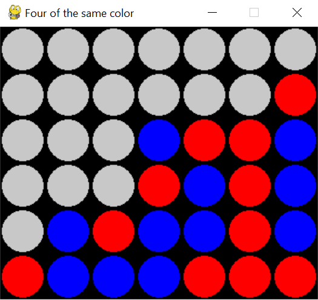

# four of the same color
**Four of the same color** is a turn-based game for two players that is not intended to infringe copyright. I don't expect to have any issues with _Husbro_.

## How to play
Click on a column to drop a token on your turn. If you manage to align four tokens before the Monte Carlo tree search, you win.



_A good example of how NOT to play._

## Run the game
Run the following command to run the game:
```
python ./src/play.py
```
You may experience some errors, and it's highly likely that they're due to not having installed the dependencies of this program correctly.

## But, how can I install the dependencies?
First of all, you'll need Python installed on your system, for which you're free to do a bit of Googling.
Later on, you'll need to install _pygame_ with one of the following commands:
```
pip install pygame
```
or
```
pip install -r ./requirements.txt
```